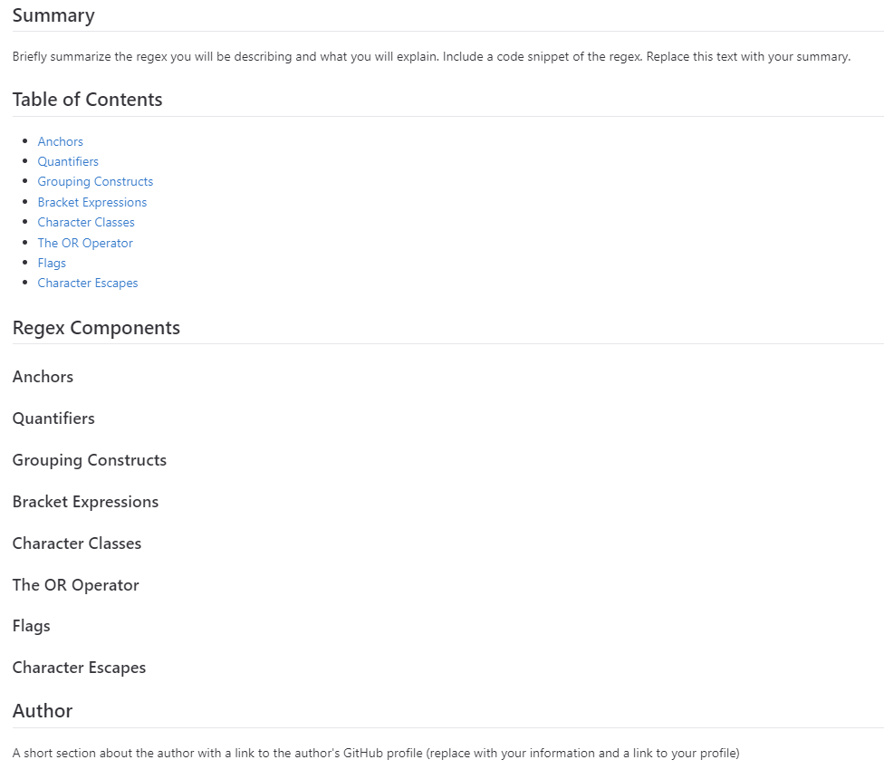

# regex-tutorial
  by allstarcoding777
  
  * ## Description
  My Github gist file includes a tutorial that explains how a specific regular expression, or regex, functions. 
  * ## Usage
Open the tutorial and you will see a descriptive title and introductory paragraph explaining the purpose of the tutorial, a summary describing the regex featured in the tutorial, a table of contents linking to different sections that break down each component of the regex and explain what it does, and a section about the author with a link to the author’s GitHub profile.

  
  
  * ## Github Repository
  https://github.com/allstarcoding777/regex-tutorial
  * ## License
  This project is licensed under the MIT license.